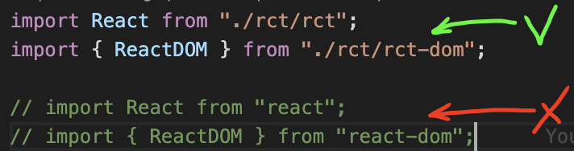

# **T H E - R E A C T - C L O N E**
Author: S.Adamovich (2023)
<br>
Version: 0.0.0
<br>
Necessary: Node ver: 16.14.0 && Yarn


<br>

[Demo of the Application](https://the-react-clone.netlify.app/)
<br>
<br>

## Install:
```powershell
$ yarn
```
<br>

## Development Mode:
```powershell
$ yarn start
```
<br>

## Build the project into 'dist' folder:
```powershell
$ yarn build
```
<br>

## Documentation
the full version of documentation come soon


<br><br>
The only hooks are supported now is 'useState' && 'useEffect'.
<br>


</br>
</br>

## In Order To Migrate to The Proper Node:
```powershell
$ sudo npm install -g n
$ n 16.14.0
```
